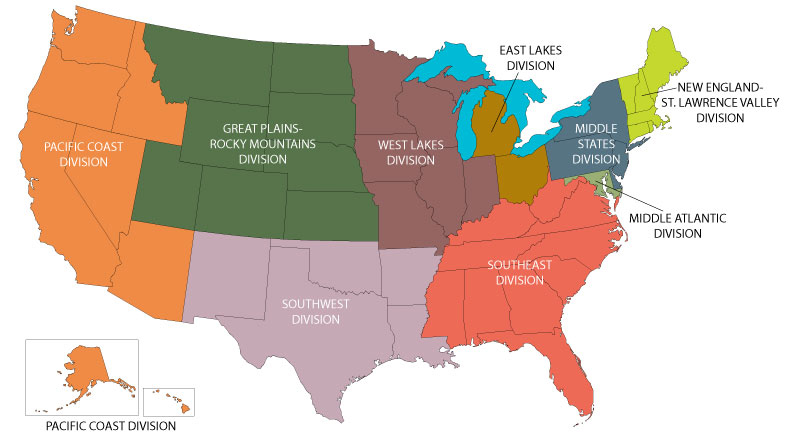

## Introduction
Compiled US sensus data of all 50 states grouped by divisions to ease comparison of data

--- .class #id 

## Comparing Data
Data collected duing a US census in 1977.
  - Population data
  - State area
  - Murder Rate
  - Illiteracy Rate
  - High School Graduation Rate
  - Income
  - Frost
  - Life Expectancy
  

---
## Zoom into divisions

Compare specific statistics based on State division

Figure: Murder rate of all states grouped by state division

--- .class #id 

## Customize views

Select division and statistic to update the chart interactively

  - Quick interactive access to relevant data
  - Easy comparison ability
  - Quick access to information

--- .class #id 

## Questions?

